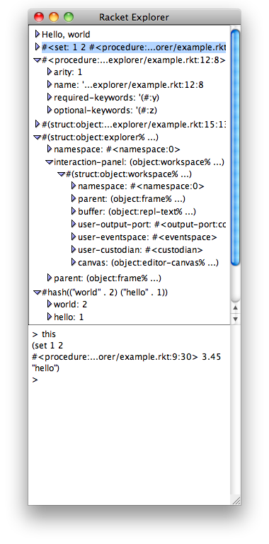

# Squeak-style Explorer for Racket

A utility for interactive exploration of complex data structures,
intended as an alternative to `pretty-print` and friends.

    $ racket example.rkt

 - Supports:
    - integers (displays in binary, octal, decimal and hex)
    - other atoms
    - pairs, vectors and lists
    - hash-tables and sets
    - object fields
    - non-opaque structs
    - procedures
    - syntax objects
    - paths
    - boxes
    - promises (forces the promise when you click on the arrow)
    - user-defined extensions
 - Interactive
    - bottom panel in explorer widget is an interactive REPL
    - currently-selected explorer item is bound to `this` global in REPL
 - Extensible
    - implement the `explorable` generic, returning an `explorer-item` from `->explorer-item`
    - override methods in subclasses of `explorer%` to customize built-in support
       - `hash-item->explorer-item` for key/value pairs
       - `procedure-explorer-items` for information on procedures

## Installation

    raco pkg install explorer

## Use

    #lang racket/base
    (require explorer)
    (explore `(some complicated #(data structure)))

You can also add items to an existing explorer:

    #lang racket/base
    (require explorer)
    (require racket/class)
    (define e (explore `(some complicated #(data structure))))
    (send e add-item! 'second-item)
    (send e add-item! 'third-item)

## Known problems and bugs

 - There is no copy and paste from the hierarchical list widget.
   (Workaround: select the item, type `this` into the REPL, hit enter,
   copy and paste from there.)

## License (MIT)

Copyright (c) 2013 Tony Garnock-Jones <tonygarnockjones@gmail.com>

Permission is hereby granted, free of charge, to any person obtaining a copy
of this software and associated documentation files (the "Software"), to deal
in the Software without restriction, including without limitation the rights
to use, copy, modify, merge, publish, distribute, sublicense, and/or sell
copies of the Software, and to permit persons to whom the Software is
furnished to do so, subject to the following conditions:

The above copyright notice and this permission notice shall be included in
all copies or substantial portions of the Software.

THE SOFTWARE IS PROVIDED "AS IS", WITHOUT WARRANTY OF ANY KIND, EXPRESS OR
IMPLIED, INCLUDING BUT NOT LIMITED TO THE WARRANTIES OF MERCHANTABILITY,
FITNESS FOR A PARTICULAR PURPOSE AND NONINFRINGEMENT. IN NO EVENT SHALL THE
AUTHORS OR COPYRIGHT HOLDERS BE LIABLE FOR ANY CLAIM, DAMAGES OR OTHER
LIABILITY, WHETHER IN AN ACTION OF CONTRACT, TORT OR OTHERWISE, ARISING FROM,
OUT OF OR IN CONNECTION WITH THE SOFTWARE OR THE USE OR OTHER DEALINGS IN
THE SOFTWARE.
